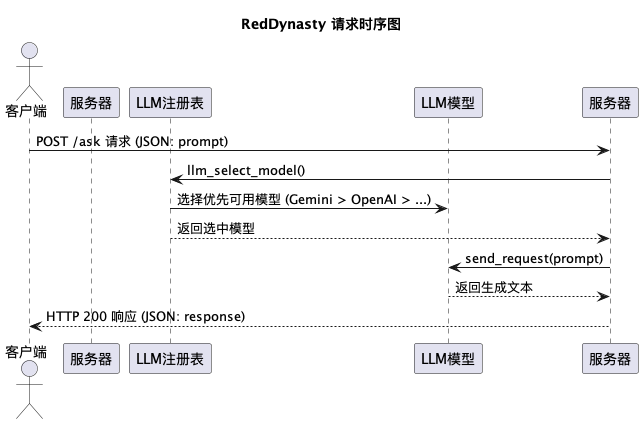
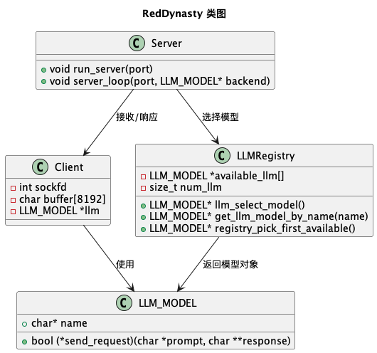
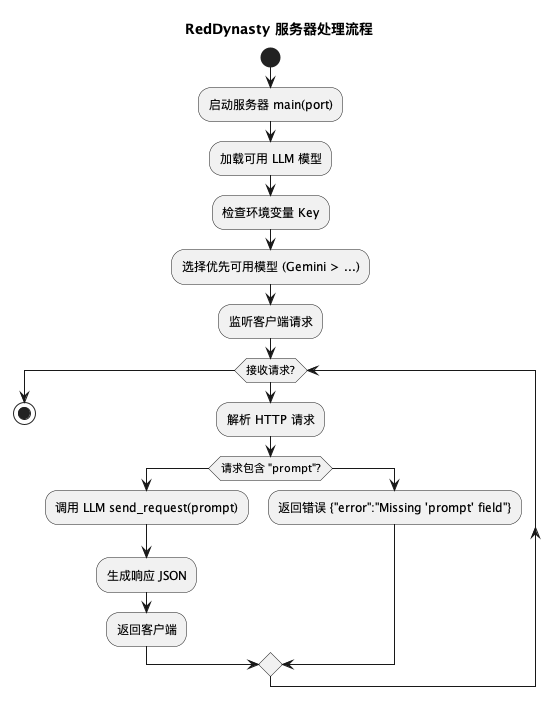

# RedDynasty：红队智能助手

> **项目状态**：本项目仍处于初期开发阶段，功能不完善，存在潜在稳定性问题或 BUG。目前仅支持 macOS 系统，其他平台未测试。

RedDynasty 是一款专为红队行动、渗透测试和网络攻防演练打造的智能大语言模型（LLM）工具。它可快速分析日志、提取关键信息、模拟攻击链、制定作战计划，为用户提供贴近红队思维的智能辅助。

---

## 功能概览

* 支持多种 LLM 模型后端：
  * Gemini  
  * OpenAI  
  * Qwen  
  * Kimi  
  * DeepSeek  
  * Grok  
* 提供 HTTP POST 接口，向指定模型发送 `prompt` 并接收返回结果
* 内置提示工程，确保 AI 响应贴合网络安全场景

> Gemini 模型优先，如果不可用会自动切换至其他可用模型。

---

## 安装与依赖

### 系统要求

* macOS

### 安装依赖

```bash
brew install curl jansson
````

### 克隆与编译

```bash
git clone <repo-url>
cd RedDynasty
make
```

> 编译成功后，会生成可执行文件 `main`。

---

## 配置 API Key

在 shell 配置文件（如 `~/.zshrc` 或 `~/.bash_profile`）中添加：

```bash
export GEMINI_API_KEY="<你的 Gemini API Key>"
export OPENAI_API_KEY="<你的 OpenAI API Key>"
export QWEN_API_KEY="<你的 Qwen API Key>"
export KIMI_API_KEY="<你的 Kimi API Key>"
export DEEPSEEK_API_KEY="<你的 DeepSeek API Key>"
export GROK_API_KEY="<你的 Grok API Key>"
export OPENROUTER_API_KEY="<你的 OpenRouter API Key>"
```

> 至少配置一个有效的 API Key，系统会根据优先级选择模型。

---

## 启动服务

```bash
./main 8000
```

启动示例输出：

```
[*] GEMINI_API_KEY found
[*] OPENAI_API_KEY found
[*] 服务器正在端口 0x1F40 (8000) 启动
[+] 已选择 backend: gemini
```

---

## 使用示例

### HTTP POST 请求

```bash
curl -X POST http://localhost:8000/ask \
     -H "Content-Type: application/json" \
     -d '{"prompt":"你好，世界"}'
```

### 响应示例

```json
{
    "response": "[Gemini] 你好，世界"
}
```

> JSON body 必须包含 `"prompt"` 字段，否则会返回 `Missing 'prompt' field` 错误。

---

## 常见问题

1. **API Key 配置问题**

   * 检查环境变量是否正确导出
   * 确保至少有一个有效 Key

2. **Quota 超限**

   * Gemini 或其他模型可能有免费配额限制
   * 等待配额刷新或切换到其他模型

3. **编译或启动失败**

   * 确保使用 macOS
   * 确保依赖安装正确 (`curl`, `jansson`)

---

## 项目结构

```
RedDynasty/
├── backend/          # 模型后端实现
├── include/          # 头文件
├── src/              # 核心源代码
├── database/         # CVE/漏洞数据库
├── test/             # 测试文件
├── docs/             # 文档与 UML 图片
├── Makefile
├── Readme.md
└── .env.example
```

---

## 系统设计与架构

RedDynasty 的请求处理流程及内部类关系如下，帮助理解客户端到 LLM 的调用逻辑。

### 时序图



### 类图



### 流程图



> UML 图示解释了客户端请求、HTTP 解析、LLM 模型选择、响应生成的完整流程。

---

## 未来规划

* 更多模型支持
* 跨平台（Linux/Windows）支持
* 错误处理优化
* 高级功能（流式响应、多轮对话、自定义参数）
* 安全性增强（HTTPS、访问控制）

---

## 🌟 开源项目赞助计划

### 用捐赠助力发展

感谢您使用本项目！您的支持是开源持续发展的核心动力。  
每一份捐赠都将直接用于：  
✅ 服务器与基础设施维护（魔法城堡的维修费哟~）  
✅ 新功能开发与版本迭代（魔法技能树要升级哒~）  
✅ 文档优化与社区建设（魔法图书馆要扩建呀~）

点滴支持皆能汇聚成海，让我们共同打造更强大的开源工具！  
（小仙子们在向你比心哟~）

---

### 🌐 全球捐赠通道

#### 国内用户

<div align="center" style="margin: 40px 0">

<div align="center">
<table>
<tr>
<td align="center" width="300">

<br />
<strong>🔵 支付宝</strong>（小企鹅在收金币哟~）
</td>
<td align="center" width="300">

<br />
<strong>🟢 微信支付</strong>（小绿龙在收金币哟~）
</td>
</tr>
</table>
</div>
</div>

#### 国际用户

<div align="center" style="margin: 40px 0">
  <a href="https://qr.alipay.com/fkx19369scgxdrkv8mxso92" target="_blank">
    
  </a>
  
  <a href="https://ko-fi.com/F1F5VCZJU" target="_blank">
    
  </a>
  
  <a href="https://www.paypal.com/paypalme/ctkqiang" target="_blank">
    
  </a>
  
  <a href="https://donate.stripe.com/00gg2nefu6TK1LqeUY" target="_blank">
    
  </a>
</div>

---

### 📌 开发者社交图谱

#### 技术交流

<div align="center" style="margin: 20px 0">
  <a href="https://github.com/ctkqiang" target="_blank">
    
  </a>
  
  <a href="https://stackoverflow.com/users/10758321/%e9%92%9f%e6%99%ba%e5%bc%ba" target="_blank">
    
  </a>
  
  <a href="https://www.linkedin.com/in/ctkqiang/" target="_blank">
    
  </a>
</div>

#### 社交互动

<div align="center" style="margin: 20px 0">
  <a href="https://www.instagram.com/ctkqiang" target="_blank">
    
  </a>
  
  <a href="https://twitch.tv/ctkqiang" target="_blank">
    
  </a>
  
  <a href="https://github.com/ctkqiang/ctkqiang/blob/main/assets/IMG_9245.JPG?raw=true" target="_blank">
    
  </a>
</div>

---

🙌 感谢您成为开源社区的重要一员！  
💬 捐赠后欢迎通过社交平台与我联系，您的名字将出现在项目致谢列表！